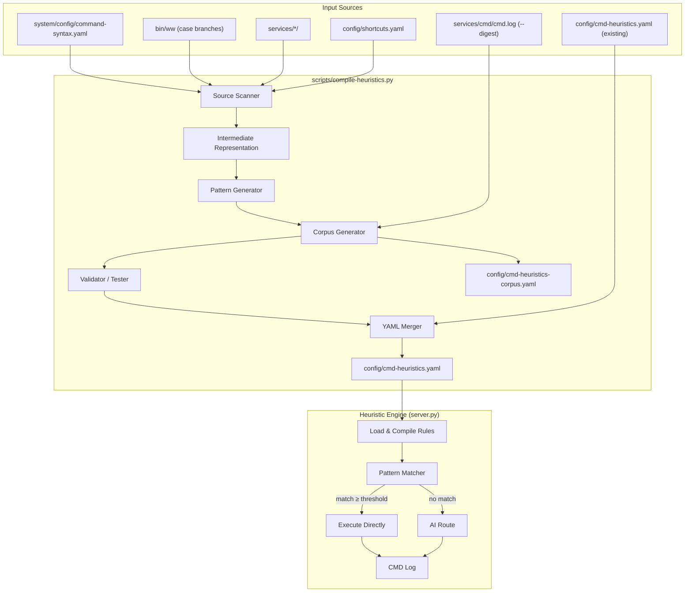

# Design Document: Heuristic Compilation

## Overview

The Heuristic Compilation system is a Python-based build tool that analyzes the entire workwarrior command surface, generates regex-based heuristic rules for natural language → command translation, validates them against a synthetic corpus, and outputs a comprehensive `config/cmd-heuristics.yaml`. The goal is to expand the current 12 builtin rules to hundreds of high-quality rules covering every ww domain, so that routine natural language inputs bypass the LLM entirely.

The system has two main deliverables:
1. **The Compiler** (`scripts/compile-heuristics.py`): a standalone Python 3 script (stdlib only) that scans sources, generates rules, tests them, and writes YAML output.
2. **The Heuristic Engine** (integrated into `services/browser/server.py`): loads compiled rules at startup and matches incoming natural language before falling back to the AI route.

The compiler is invoked via `ww compile-heuristics` or directly as `python3 scripts/compile-heuristics.py`.

## Architecture



### Data Flow

1. **Scan**: The compiler reads `command-syntax.yaml`, parses `bin/ww` case branches, scans service scripts, and reads `config/shortcuts.yaml` to build a complete command inventory.
2. **Generate**: For each discovered command, the pattern generator produces 6+ regex variations covering imperative, declarative, interrogative, and shorthand forms.
3. **Corpus**: A synthetic corpus of 200+ natural language → command pairs is generated, covering all domains and phrasing styles. Optionally, real AI log entries are merged via `--digest`.
4. **Validate**: Each generated rule is tested against sample inputs. Failing rules are excluded. Conflicts (overlapping patterns) are resolved by keeping the higher-confidence rule.
5. **Merge**: New rules are merged with existing `config/cmd-heuristics.yaml`, preserving `count` values and `manual` source rules.
6. **Output**: The final YAML is written, organized by domain sections.

At runtime, `server.py` loads the YAML at startup, compiles all regex patterns, and evaluates them against each incoming `POST /cmd/ai` request before attempting the AI route.

## Components and Interfaces

### 1. Source Scanner (`scanner.py` module within the script)

Responsible for extracting the complete command inventory from all sources.

```python
@dataclass
class CommandEntry:
    domain: str           # e.g. "profile", "journal", "task"
    subcommand: str       # e.g. "create", "add", "list"
    syntax: str           # e.g. "ww profile create <name>"
    required_args: list[str]  # e.g. ["name"]
    optional_args: list[str]  # e.g. ["dest"]
    aliases: list[str]    # e.g. ["profiles"]
    source: str           # "command-syntax.yaml", "bin/ww", "service-script"

def scan_command_syntax(yaml_path: str) -> list[CommandEntry]:
    """Parse command-syntax.yaml and extract all command entries."""

def scan_bin_ww(script_path: str) -> list[CommandEntry]:
    """Parse bin/ww case branches via regex to extract command patterns."""

def scan_service_scripts(services_dir: str) -> list[CommandEntry]:
    """Scan service shell scripts for additional command patterns."""

def scan_shortcuts(yaml_path: str) -> list[CommandEntry]:
    """Parse shortcuts.yaml and extract shortcut aliases."""

def build_command_inventory(ww_base: str) -> tuple[list[CommandEntry], list[str]]:
    """Aggregate all sources, deduplicate, flag discrepancies.
    Returns (commands, discrepancy_warnings)."""
```

### 2. Pattern Generator

Converts each `CommandEntry` into multiple `HeuristicRule` objects with regex patterns.

```python
@dataclass
class HeuristicRule:
    pattern: str          # regex string (case-insensitive)
    action: str           # command template with $N substitutions
    confidence: float     # 0.85 - 1.0
    source: str           # "compiled"
    count: int            # 0 for new rules
    domain: str           # for grouping in output
    sample_inputs: list[str]  # generated test inputs

# Filler word groups (non-capturing, optional)
ARTICLES = r"(?:a |the |my )?"
PREPS = r"(?:to |for |on |about |in )?"
POLITE = r"(?:please |can you |I want to |I need to |could you )?"

# Date expression mapping
DATE_PATTERNS = {
    "tomorrow": "tomorrow",
    "next week": "1w",
    "friday": "friday",
    "next monday": "monday",
    "in (\\d+) days?": lambda m: f"{m.group(1)}d",
    "end of month": "eom",
    # ... more patterns
}

def generate_patterns(cmd: CommandEntry) -> list[HeuristicRule]:
    """Generate 6+ regex variations for a single command.
    
    Variation types:
    1. Direct passthrough:  "task add <desc>" → confidence 1.0
    2. Imperative:          "add a task ..." → confidence 0.95
    3. Declarative:         "I need a task for ..." → confidence 0.90
    4. Interrogative:       "can you create a task ..." → confidence 0.90
    5. Shorthand:           "task: <desc> due friday" → confidence 0.90
    6. Verbose/natural:     "I would like to create a new task called ..." → confidence 0.85
    """

def generate_composition_patterns() -> list[HeuristicRule]:
    """Generate multi-command patterns for common workflows:
    - task creation + annotation
    - task creation + time tracking start
    - task completion + time tracking stop
    """

def assign_confidence(pattern_type: str, has_ambiguous_captures: bool) -> float:
    """Assign confidence based on pattern specificity."""
```

#### Regex Generation Algorithm

For each command, the generator follows this process:

1. **Parse the syntax template**: Extract the domain, subcommand, and argument placeholders (e.g., `<name>`, `<desc>`, `[dest]`).
2. **Build the action template**: Map argument positions to `$N` substitution variables.
3. **Generate variation regexes**:
   - **Passthrough**: Literal command string with capture groups for args. Confidence: 1.0.
   - **Imperative verb swap**: Replace the subcommand with natural synonyms (add→create/new/make, list→show/display, delete→remove/drop). Wrap filler words as optional non-capturing groups. Confidence: 0.95.
   - **Declarative**: Prefix with `POLITE` group + "I want/need" + verb. Confidence: 0.90.
   - **Interrogative**: Prefix with "can you/could you/would you" + verb. Confidence: 0.90.
   - **Shorthand**: `domain: args` or `domain args` without verb. Confidence: 0.90.
   - **Verbose**: Full sentence with extra filler ("I would like to create a new task called X that is due Y"). Confidence: 0.85.
4. **Handle optional args**: For commands with optional arguments, generate separate patterns for the base command and for each optional arg combination.
5. **Handle date expressions**: For time-related arguments, inject date pattern alternatives as a sub-pattern group.

### 3. Corpus Generator

```python
@dataclass
class CorpusEntry:
    input_text: str       # natural language
    expected_command: str  # ww command(s)
    domain: str
    style: str            # "casual", "formal", "terse", "verbose", "conversational"

def generate_synthetic_corpus(commands: list[CommandEntry]) -> list[CorpusEntry]:
    """Generate 200+ corpus entries covering all domains and phrasing styles.
    
    For each domain, generates entries in 5 styles:
    - casual: "add a task for groceries"
    - formal: "please create a new task"
    - terse: "task groceries due tomorrow"
    - verbose: "I would like to create a new task called groceries..."
    - conversational: "hey can you make me a task to buy groceries"
    """

def read_cmd_log_digest(log_path: str) -> list[CorpusEntry]:
    """Read cmd.log JSONL, extract entries where route=ai and ok=true.
    Returns corpus entries from real AI translations."""

def merge_corpus(synthetic: list[CorpusEntry], digest: list[CorpusEntry]) -> list[CorpusEntry]:
    """Merge synthetic and digest corpus, deduplicating by input_text."""

def write_corpus_yaml(corpus: list[CorpusEntry], output_path: str) -> None:
    """Write corpus to config/cmd-heuristics-corpus.yaml."""
```

### 4. Validator / Tester

```python
@dataclass
class TestResult:
    rule: HeuristicRule
    sample_input: str
    matched: bool
    produced_command: str
    expected_command: str
    passed: bool

@dataclass
class ValidationReport:
    total_rules: int
    passed: int
    failed: int
    conflicts_discarded: int
    coverage_pct: float       # commands with ≥1 passing rule / total commands
    rules_per_domain: dict[str, int]
    failures: list[TestResult]

def validate_rule(rule: HeuristicRule) -> list[TestResult]:
    """Test a rule against its sample inputs. Returns test results."""

def detect_conflicts(rules: list[HeuristicRule]) -> list[tuple[HeuristicRule, HeuristicRule]]:
    """Find pairs of rules that match the same input with different outputs."""

def resolve_conflicts(conflicts: list[tuple], rules: list[HeuristicRule]) -> list[HeuristicRule]:
    """Keep higher-confidence rule, discard the other. Returns filtered list."""

def validate_corpus_coverage(rules: list[HeuristicRule], corpus: list[CorpusEntry]) -> list[CorpusEntry]:
    """Return corpus entries not matched by any rule (gaps)."""

def run_validation(rules: list[HeuristicRule], corpus: list[CorpusEntry], 
                   commands: list[CommandEntry]) -> ValidationReport:
    """Full validation pipeline: test rules, detect conflicts, check coverage."""
```

### 5. YAML Merger / Output Writer

```python
def load_existing_rules(yaml_path: str) -> tuple[dict, list[dict]]:
    """Load existing cmd-heuristics.yaml. Returns (config, rules)."""

def merge_rules(existing: list[dict], compiled: list[HeuristicRule]) -> list[dict]:
    """Merge compiled rules with existing:
    - Preserve count values from existing rules
    - Update patterns where compiled has higher confidence
    - Preserve rules with source='manual' unchanged
    - Append new rules
    """

def write_heuristics_yaml(config: dict, rules: list[dict], output_path: str) -> None:
    """Write config/cmd-heuristics.yaml organized by domain sections with YAML comments."""
```

### 6. Heuristic Engine (server.py integration)

```python
class HeuristicEngine:
    """Loaded at server startup. Evaluates rules against input."""
    
    def __init__(self, yaml_path: str, threshold: float = 0.8):
        self.threshold = threshold
        self.rules: list[CompiledRule] = []
        self._load_rules(yaml_path)
    
    def _load_rules(self, yaml_path: str) -> None:
        """Parse YAML, compile regex patterns."""
    
    def match(self, input_text: str) -> Optional[MatchResult]:
        """Evaluate input against all rules.
        Returns the highest-confidence match above threshold, or None."""
    
    def increment_count(self, rule_index: int) -> None:
        """Increment usage count for a matched rule."""
    
    def flush_counts(self, yaml_path: str) -> None:
        """Periodically write updated counts back to YAML."""

@dataclass
class CompiledRule:
    pattern: re.Pattern
    action_template: str
    confidence: float
    source: str
    count: int
    domain: str

@dataclass
class MatchResult:
    command: str          # resolved action template
    confidence: float
    rule_index: int
    domain: str
```

### 7. Multi-Command Composition (in Heuristic Engine)

```python
CONJUNCTIONS = re.compile(r'\b(?:and|then|also|plus)\b', re.IGNORECASE)

def split_compound_input(input_text: str) -> list[str]:
    """Split input on conjunctions into individual segments."""

def match_compound(self, input_text: str) -> Optional[list[MatchResult]]:
    """Try to match compound inputs by splitting on conjunctions
    and matching each segment independently."""
```

## Data Models

### Intermediate Representation (Command Inventory)

```yaml
# In-memory structure, not persisted as a file
commands:
  - domain: "profile"
    subcommand: "create"
    syntax: "ww profile create <name>"
    required_args: ["name"]
    optional_args: []
    aliases: ["profiles"]
    source: "command-syntax.yaml"
  - domain: "task"
    subcommand: "add"
    syntax: "task add <description>"
    required_args: ["description"]
    optional_args: ["priority", "due", "project", "tags"]
    aliases: []
    source: "bin/ww"
```

### Heuristic Rules YAML Schema (output)

```yaml
# config/cmd-heuristics.yaml
threshold: 0.8

rules:
  # --- Task Operations ---
  - pattern: "^task add (.+)"
    action: "task add $1"
    confidence: 1.0
    source: compiled
    count: 0

  - pattern: "^(?:please |can you |I want to |I need to )?(?:create|add|new|make) (?:a |the |my )?task (?:to |for |about )?(.+)"
    action: "task add $1"
    confidence: 0.90
    source: compiled
    count: 0

  # --- Time Operations ---
  - pattern: "^timew start (.+)"
    action: "timew start $1"
    confidence: 1.0
    source: compiled
    count: 0

  # ... organized by domain with YAML comment headers
```

### Synthetic Corpus YAML Schema

```yaml
# config/cmd-heuristics-corpus.yaml
generated: "2026-04-15T10:00:00Z"
total_entries: 215
entries:
  - input: "add a task for groceries"
    command: "task add groceries"
    domain: task
    style: casual

  - input: "please create a new task"
    command: "task add"
    domain: task
    style: formal

  - input: "task groceries due tomorrow"
    command: "task add groceries due:tomorrow"
    domain: task
    style: terse

  - input: "start tracking time on project meeting"
    command: "timew start project meeting"
    domain: time
    style: casual
```

### CMD Log Entry Schema (existing, for --digest)

```jsonl
{"command": "...", "mode": "ai", "provider": "ollama", "model": "...", "route": "ai", "commands": [...], "output": "...", "ok": true, "ts": "...", "profile": "..."}
```

### Compilation Report Schema (stdout)

```
=== Heuristic Compilation Report ===
Commands discovered: 87
Rules generated:     523
Rules passed:        510
Rules failed:        8
Rules discarded:     5 (conflicts)
Coverage:            96.5% (84/87 commands)

Per-domain breakdown:
  task:       72 rules
  time:       45 rules
  journal:    28 rules
  profile:    65 rules
  ...

Discrepancies:
  - bin/ww has 'sword' command not in command-syntax.yaml
```


## Correctness Properties

*A property is a characteristic or behavior that should hold true across all valid executions of a system — essentially, a formal statement about what the system should do. Properties serve as the bridge between human-readable specifications and machine-verifiable correctness guarantees.*

### Property 1: YAML Scanning Completeness

*For any* valid `command-syntax.yaml` containing N command entries across M domains, and any valid `shortcuts.yaml` containing K shortcuts, the scanner SHALL extract exactly N command entries and K shortcut entries, each with all required fields (domain, subcommand, syntax, required_args, optional_args) populated.

**Validates: Requirements 1.1, 1.4, 1.5**

### Property 2: Discrepancy Detection

*For any* two sets of command patterns — one from `command-syntax.yaml` and one from `bin/ww` — the compiler SHALL flag every command present in `bin/ww` but absent from `command-syntax.yaml`, and the set of flagged discrepancies SHALL equal the exact set difference.

**Validates: Requirements 1.6**

### Property 3: Pattern Variation Completeness

*For any* CommandEntry, the pattern generator SHALL produce at least 6 regex variations that collectively include at least one pattern of each form type: passthrough, imperative, declarative, interrogative, shorthand, and verbose.

**Validates: Requirements 2.1, 2.7**

### Property 4: Optional Argument Pattern Generation

*For any* CommandEntry with K optional arguments (K > 0), the pattern generator SHALL produce separate patterns for the base command (no optional args) and for at least one combination including optional arguments, resulting in more patterns than an equivalent command with zero optional arguments.

**Validates: Requirements 2.3**

### Property 5: Filler Word Tolerance

*For any* generated HeuristicRule and any matching sample input, inserting any combination of filler words (articles: "a", "the", "my"; prepositions: "to", "for", "on"; politeness: "please", "can you") at natural insertion points SHALL still produce a regex match yielding the same action output.

**Validates: Requirements 2.4**

### Property 6: Date Expression Mapping

*For any* natural date expression in the supported set (e.g., "tomorrow", "next week", "friday", "in N days", "end of month"), the date mapper SHALL produce the correct tool-native format, and mapping then un-mapping (where reversible) SHALL preserve the semantic meaning.

**Validates: Requirements 2.5**

### Property 7: Confidence Assignment Correctness

*For any* generated HeuristicRule, the assigned confidence score SHALL match the rule for its pattern type: direct passthrough = 1.0, single-variation imperative = 0.95, multi-variation = 0.90, ambiguous captures = 0.85, and all scores SHALL fall within [0.85, 1.0].

**Validates: Requirements 2.6**

### Property 8: Compound Input Splitting

*For any* two valid single-command natural language inputs A and B, joining them with any conjunction ("and", "then", "also", "plus") SHALL cause the engine to split the compound input and produce both commands in order.

**Validates: Requirements 3.1**

### Property 9: Corpus Domain and Style Coverage

*For any* command inventory with D domains, the generated synthetic corpus SHALL contain at least 200 entries, every domain SHALL have at least one entry, and each domain SHALL have entries in at least 3 of the 5 phrasing styles (casual, formal, terse, verbose, conversational).

**Validates: Requirements 4.1, 4.2**

### Property 10: Pattern-Corpus Validation

*For any* generated HeuristicRule, there SHALL exist at least one synthetic corpus entry whose input text matches the rule's regex pattern and whose expected command equals the action template output after substitution.

**Validates: Requirements 4.4**

### Property 11: Gap-Filling Rule Creation

*For any* synthetic corpus entry not matched by any rule in the initial generated set, the compiler SHALL create a new rule that matches that entry's input and produces the expected command.

**Validates: Requirements 4.5**

### Property 12: Rule Sample Validation

*For any* generated HeuristicRule, it SHALL have at least 2 sample inputs, and each sample input SHALL match the rule's regex pattern and produce a syntactically valid ww command via the action template.

**Validates: Requirements 5.1**

### Property 13: Failed Rule Exclusion

*For any* HeuristicRule whose sample inputs fail to match its regex pattern or produce incorrect commands, that rule SHALL NOT appear in the final output YAML.

**Validates: Requirements 5.2**

### Property 14: Conflict Resolution Correctness

*For any* set of generated rules, if two rules match the same input and produce different commands, the rule with the lower confidence score SHALL be discarded, and the final rule set SHALL contain no pair of rules that match the same input with different outputs.

**Validates: Requirements 5.3, 5.4**

### Property 15: Report Metric Invariants

*For any* compilation run, the report metrics SHALL satisfy: `passed + failed + discarded == total_rules_generated`, and `coverage_pct == (commands_with_at_least_one_passing_rule / total_commands) * 100`.

**Validates: Requirements 5.5, 7.7**

### Property 16: YAML Output Round-Trip

*For any* set of HeuristicRules, writing them to `cmd-heuristics.yaml` and re-reading the file SHALL produce an equivalent set of rules with all fields (pattern, action, confidence, source, count) preserved exactly.

**Validates: Requirements 6.1**

### Property 17: Merge Preserves Counts and Updates Confidence

*For any* existing rule set E and compiled rule set C, merging SHALL preserve the `count` value from E for rules that exist in both sets, and SHALL update the pattern/confidence only when the compiled version has strictly higher confidence.

**Validates: Requirements 6.2**

### Property 18: Manual Rules Immutability

*For any* merge operation, every rule in the existing set with `source: "manual"` SHALL appear in the merged output with all fields (pattern, action, confidence, count) unchanged.

**Validates: Requirements 6.4**

### Property 19: Engine Match Selection

*For any* input text and set of loaded rules, the engine SHALL return the match with the highest confidence score among all rules that match with confidence ≥ threshold. If no rule matches at or above the threshold, the engine SHALL return no match (triggering AI fallback).

**Validates: Requirements 8.3, 8.6**

### Property 20: Engine Count Increment

*For any* successful heuristic match, the matched rule's `count` field SHALL be incremented by exactly 1, and no other rule's count SHALL change.

**Validates: Requirements 8.4**

## Error Handling

### Compiler Errors

| Error Condition | Handling |
|---|---|
| `command-syntax.yaml` not found or invalid YAML | Exit with error code 1 and descriptive message. Do not produce partial output. |
| `bin/ww` not found or unreadable | Log warning, continue with other sources. Flag in report. |
| Service script parse failure | Log warning per-script, continue scanning other scripts. |
| `config/shortcuts.yaml` missing | Log warning, continue without shortcuts. |
| Regex compilation failure for a generated pattern | Exclude the rule, log the failure with pattern text. Continue with other rules. |
| `cmd.log` missing when `--digest` used | Log warning, continue with synthetic corpus only. |
| `cmd.log` contains malformed JSONL lines | Skip malformed lines, log count of skipped lines. |
| Output YAML write failure (permissions, disk) | Exit with error code 2 and descriptive message. |
| Existing `cmd-heuristics.yaml` is malformed | Log warning, treat as empty (no existing rules to merge). Back up the malformed file. |

### Engine Errors

| Error Condition | Handling |
|---|---|
| `cmd-heuristics.yaml` not found at startup | Log warning, initialize with empty rule set. All inputs go to AI route. |
| `cmd-heuristics.yaml` contains invalid YAML | Log error, initialize with empty rule set. |
| Individual regex pattern fails to compile | Skip that rule, log warning. Load remaining rules. |
| Action template substitution produces empty command | Treat as no-match, fall through to AI route. |
| Count flush to disk fails | Log warning, keep counts in memory. Retry on next flush cycle. |
| Compound input splitting produces unrecognizable segments | Fall through to AI route for the entire input. |

### Graceful Degradation

The system is designed so that failures in the heuristic layer never block command execution. The AI route is always available as a fallback. If the entire heuristic engine fails to initialize, the system operates exactly as it does today (AI-only mode).

## Testing Strategy

### Property-Based Tests (Hypothesis)

The project will use **Hypothesis** (Python) for property-based testing, as the compiler is a Python script.

Each correctness property maps to a property-based test with minimum 100 iterations:

- **Scanner tests**: Generate random YAML structures, verify extraction completeness (Properties 1, 2)
- **Pattern generator tests**: Generate random CommandEntry objects, verify variation count, form types, filler tolerance, confidence scores (Properties 3–7)
- **Compound splitting tests**: Generate pairs of valid inputs joined by conjunctions (Property 8)
- **Corpus tests**: Generate random command inventories, verify corpus size/coverage/style diversity (Property 9)
- **Validation tests**: Generate rules with sample inputs, verify matching and exclusion logic (Properties 10–14)
- **Report metric tests**: Generate random validation results, verify arithmetic invariants (Property 15)
- **YAML round-trip tests**: Generate random rule sets, write and re-read (Property 16)
- **Merge tests**: Generate existing + compiled rule sets, verify merge behavior (Properties 17, 18)
- **Engine tests**: Generate rules and inputs, verify match selection and count behavior (Properties 19, 20)

Each test tagged with: `# Feature: heuristic-compilation, Property N: <property_text>`

### Unit Tests (pytest)

- Specific examples for each domain's pattern generation (task add, timew start, journal add, profile create, etc.)
- Edge cases: empty input, input with only filler words, extremely long input, special characters in arguments
- Date expression mapping for each supported format
- Composition pattern examples (task + annotation, task + time tracking)
- YAML output format verification (domain section comments, threshold field)
- CMD log parsing with malformed entries
- Report output format verification

### Integration Tests

- Full pipeline test: scan real `command-syntax.yaml` → generate rules → validate → write YAML
- Engine integration: load generated YAML into HeuristicEngine, test against known inputs
- Merge test with real existing `cmd-heuristics.yaml`
- `--digest` flag with real `cmd.log` data
- `--verbose` and `--digest` report output verification
- Domain coverage verification against real command inventory (Requirements 7.1–7.6)
